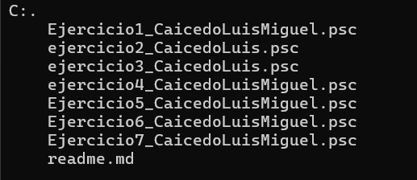

# REcuperación de filtro
## Descripción 
en este repositorio se subieron una serie de programas de PSeint

## tecnologías utilizadas

- **PSeint**

## Estructura

## Archivos
|Nombre|Descripción|
|--|--|
|Ejercicio1_CaicedoLuisMiguel.psc|Es un programa que permite almacenar datos de personas y luego mustra al usuario ciertas especificaciones|
|ejercicio2_CaicedoLuis.psc|Es un programa que puede almacenar la estatura y nombres de personas y ordenarlas de las mas alta a la mas vaja y viceversa|
|ejercicio3_CaicedoLuis.psc|este programa pide una lista de números y luego pide otro número al usuario para poder verificar si está en la lista, si el número está entoces se mostrará en que posición está|
|ejercicio4_CaicedoLuisMiguel.psc|Este programa permite almacenar en una lista números entre el 50 y 100 para despues hacer una lista con los números pares y otra con los impares y mostrarlas al usuario|
|Ejercicio5_CaicedoLuisMiguel.psc|Este programa permite almacenar en un arreglo los nombres de 30 estudiantes de un curso y en una matriz, las 5 notas obtenidas por cada uno de los estudiantes durante el semestre. Da la nota definitiva de cada uno, puede encontrar el estudiante que obtuvo la mayor nota definitiva, puede mostrar quienes perdieron y quienes deben habilitarla y tambien muestra quienes la aprobaron.|
|Ejercicio6_CaicedoLuisMiguel.psc|Es un programa que puede almacenar ciertos datos de pacientes en una clínica y devuelve ciertos datos.|
|Ejercicio7_CaicedoLuisMiguel.psc|Es un programa de un juego que genera un numero aleatorio y el usuario tiene que adivinarlo en 10 intentos o menos.|

## Ejecución
Para ejercutar alguno de estos programas deberás seguir los siguientes pasos:
### Paso 1:
Nesesitas tener instalado PSeint que es donde se ejecutaran los programas
### Paso 2:
Tendras que descargar este repositorio
### Paso 3:
En la aplicación de PSeint tendras que abrir el archivo del programa que deseas ejecutar
### Paso 4:
ya estando en el archivo encontrarás en la parte superior el icono de ejecutar que es de color verde le das click y ya estará listo para utilizar
## Contacto
E-mail: luismiguel110205@gmail.com
## Autor
- **Luis Miguel Caicedo Bermon**